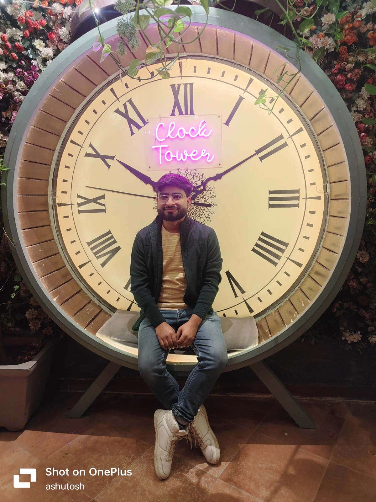

# Marriage Proposal Biodata

---
### Personal Information  
- **Full Name:** Ashutosh Verma  
- **Date of Birth:** 4th Feb 1998  
- **Age:** 27 years  
- **Gender:** Male  
- **Height:** 5'5''  
- **Weight:** 70 kg  
- **Blood Group:** O-  
- **Nationality:** Indian  
- **Religion:** Hindu  
- **Mother Tongue:** Hindi  

---

### Educational Background  
- **Bachelor of Technology (B.Tech):** Gurukul Kangri University, Haridwar (2015–2019)  
- **Intermediate (Class XII):** SSIC Barabanki (2012-2014)  
- **High School (Class X):** SSIC Barabanki (2010-2012)  

---

### Professional Background  
- **Current Role:** Tech Lead  
- **Current Company:** NAV Backoffice Pvt. Ltd, Jaipur (2024–Present)  
- **Previous Roles:**  
  - ShyftLabs, Gurugram (2023–2024)  
  - ORNAZ, Gurugram (2018–2023)  
- **Experience:** 7+ years in software engineering & leadership  

---

### Family Details  
- **Father's Name & Occupation:** Mr. Vinay Kumar, Farmer  
- **Mother's Name & Occupation:** Mrs. Sarita Verma, Homemaker  
- **Siblings:** Younger Brother: Anshuman Verma (B.Tech-CSE), Elder-Sister: Mrs. Nidhi Verma (post-Graduate)
- **Native Place:** Barabanki, U.P.  

---

### Lifestyle & Preferences  
- **Diet:** Vegetarian  
- **Hobbies & Interests:** Tech blogging, Building side Projects, Reading, Travel  
- **Languages Known:** Hindi, English  
- **Personality Traits:** Calm, ambitious, family-oriented
- **Future Plans:** Continue in tech leadership, open to global opportunities, long-term settlement in India  

---

### Expectations  
- Looking for a **well-educated, understanding, and family-oriented partner** with modern outlook and cultural values.  
- **Preferred Age:** 23–27 years  
